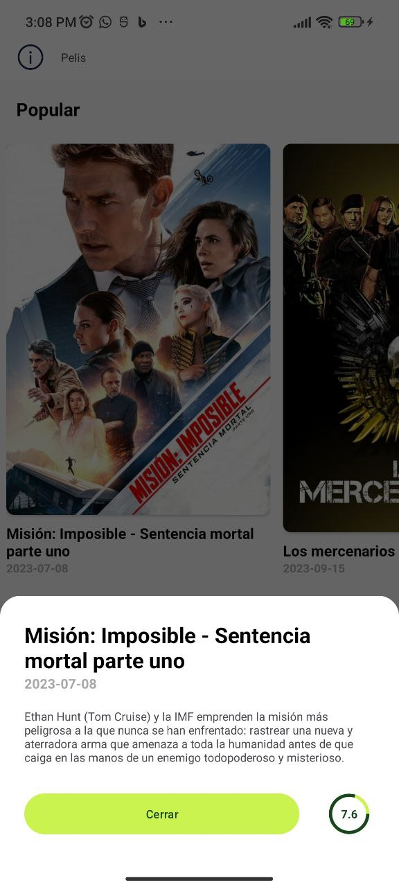

En este documento se describe brevemente la arquitectura utilizada en el proyecto, lógica, features y demás.
# OpenPayApp

## Summary
Esta aplicación se deriva de un examen técnico en donde se califica el hacer cuatro pantallas, cada pantalla con su respectiva funcionalidad.

- ## IMPORTANTE ##
Se tienen que agregar las siguientes propieades en [local.properties] ya que sino, no compilará el proyecto:
- tmdbApiKey=c0147ffe65a77deaddf68d039cd2554c
- baseUrl=https://api.themoviedb.org/3/

## Features
- **Pantalla Uno (Perfil)** En esta pantalla se muestra al actor más popular del momento. Para esto se consumieron los siguientes endpoints:
  - [Actores populares] https://developer.themoviedb.org/reference/person-popular-list
  - [Detalle de la persona] Todo esto sacado de la api: https://developer.themoviedb.org/reference/person-popular-list Si tiene internet, consume el api y guarda en base de datos la información para que la próxima vez que el usuario visite nuestra app y este no tenga internet, aún pueda seguir viendo la información.
  - 

- **Pantalla Dos (Películas)** En esta pantalla se obtienen 3 categorías de peliculas:
  - [Populares] https://developer.themoviedb.org/reference/movie-popular-list
  - [Mejores calificadas] https://developer.themoviedb.org/reference/movie-top-rated-list
  - [Proxímas películas] https://developer.themoviedb.org/reference/movie-upcoming-list
  - 
  - 

- **Pantalla Tres (Mapa)** La lógica para este fue utilizar [ForegroundServices] para poder tener procesos en segundo plano y hacer que cada 5 minutos (aunque la app no esté abierta) se esté almacenando la información en una base de datos de Firebase.
- 

- **Pantalla Cuatro (Fotos)** En esta pantalla se selecciona una de las imagenes que tiene nuestro dispositivo y la enviamos almacenar a la base de datos de Firebase.
- 
- 

- **Evidencia de guardado y uso en Firebase**
- 

Todo este proyecto hace uso de:

- [MVVM]
- [Clean Architecture]
- [Coroutines]
- [Inyección de dependencias con Dagger Hilt]
- [Constraints]
- [Styles]
- [Dimens]
- [Dialogs]
- [Casos de excepción]
- [NavigationComponent]
- [Databinding]
- [LiveData]
- [ForegroundServices]
- [Room database]
- [SQLite]
- [Buenas prácticas]

- Who's next?
Si bien, la mayor parte de la apliación fue hecha con las mejores prácticas que hay en la actualidad, creo firmemente que la falta de tiempo jugó un papel fundamental para poder entregar algo muchisimo más robusto, al menos en cuestiones de UI/UX.

¿Qué se podría mejorar en una versión posterior?
- El diseño en todas las pantallas.
- Hacer el ajuste (es muy mínimo) para que la imagen en la pantalla cuatro se almacene de forma remota.
- A pesar de haber bastantes separaciones con Dagger Hilt, creo que esto puede aumentar aún más.
- Módularizar ciertos métodos repetitivos.
- Hacer uso de Flows.

## Conclusión
En conclusión, puedo decir que es una apliación funcional que tiene un código que en la mayor parte sigue las normativas del denominado "Código limpio" y haciendo uso de buenas prácticas.
A si mismo, también cabe resaltar que con un poco más de tiempo empeñado, se puede robustecer aún más la aplicación, ya que queda la siguiente pregunta...
## Si esto se realizó en tan sólo un día y una sóla persona, **¿Qué no se haría con más tiempo o inclusvie con una persona extra**
